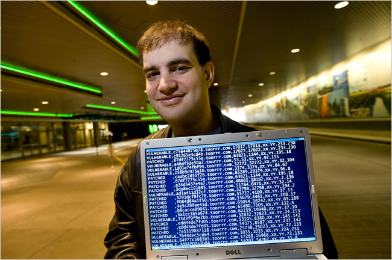

# 一次出人意料而名留青史的DNS投毒攻击



2008年7月，在互联网上发生了一件极具历史意义的DNS安全事件，该事件一经发布，立即震动了整个互联网，因为，自1983年DNS被发明以来，人们还从未遇到过这类影响深远而易于实现的攻击。Cricket Liu, 《DNS and BIND》（O'Reilly出版）的作者， 认为这**可能是互联网历史上最大的一次DNS安全事件。**[^cory]

这个攻击是美国人Dan Kaminsky精心构造的，他本人因此一战成名，该攻击也因此被命名为Kaminsky攻击。

漏洞由CERT于2008年7月8日发布[^cert]，但没有公布细节，Dan那时正在协助一些DNS厂商补上这个漏洞，并计划于8月6日在拉斯维加斯召开的Black Hat年度安全大会上披露全部细节内容（然而漏洞细节还是在7月21日被泄漏了出来），由于明明知道有漏洞却又不知道到底怎么回事，当时安全圈内颇有一些人对Dan表示了不满[^circle]。

该攻击令人恐惧之处在于，攻击者并不要求有什么特别的条件（比如占据某个路由交换节点可以监听和修改DNS报文），也无需使用社工之类的手段，攻击者就是一个普普通通的网络用户，却可以使用该方法，无差别地在全球复现这个攻击。

攻击产生的后果是什么？

后果是DNS服务器缓存中的记录被修改（所谓被“投毒”），比如用户本来想访问www.baidu.com，如果本机没有缓存，就会向本地DNS查询该域名的IP，但由于DNS服务器被投毒，所以用户得到的IP并不是想要去的地方，而是一个攻击者设定的IP，这样，用户就被牵引到完全可能是恶意的网站。

**这种对IP的掉包，对搞信息安全的人来讲，哪怕是随便想一想，都会毛骨悚然。**

在用户层面是无法感知和防范这种攻击的，因为攻击破坏了互联网底层的基础设施：域名服务。而域名服务正是那种它不出事时你意识不到它存在，一旦出事都是大事的东西。

**本文将尽量让没有网络基础知识甚至是没有IT基础知识的人看懂。**

了解这个攻击的关键在于了解DNS的原理。

## 一、DNS基本知识：简单回顾

本章属于扫盲性质，零基础的读者一定不要错过，有基础的同学可以简要掠过。

1、我们都知道在互联网上需要用IP的，但事实上，我们在使用的时候，通常输入的是域名而不是IP，比如我们输入www.baidu.com或者www.taobao.com，这种叫域名，类似39.156.66.18这种，才是IP。

2、互联网上传输数据都是要用IP的，**DNS所干的事，就是把域名转换为IP，也即域名解析**。比如浏览器拿到www.baidu.com后，通过DNS系统转换为IP，然后和该IP（比如39.156.66.18）建立通信，交互网页数据并向用户展示。

3、互联网上有非常多的域名服务器，共同完成域名解析功能。每个域名服务器内部会记录着一些域名和IP的对应（以及其他一些类似的数据），每条这样的数据称为一个**记录**。

4、不管在我们的电脑上，还是手机上（以下统称为**终端**），都会设置有DNS服务器的地址（通常被自动配置而无需手工配置），终端需要解析的时候，就去问它，它如果知道答案，就直接回复；如果不知道，就去网上问，最终会把答案（也即那个IP）返回给终端。这个DNS服务器常被称为本地DNS，它可能确实在家里、企业里、机场里、咖啡馆里，也有可能不在本地，比如114.114.114.114或者8.8.8.8这样的公用DNS服务器。

5、本地DNS可能是一个递归DNS，也可能只是一个DNS代理。递归DNS会不厌其烦地在互联网上尽力完成解析然后把结果返回终端，代理则只是把终端的请求转发给给真正干活的递归DNS，然后把递归DNS的答案转发给终端。<font color=blue>**本文为描述方便，略去DNS代理这种简单的情况，不再区分本地DNS和递归DNS，将其统一简写为LDNS**。</font>

6、最主要的DNS服务器就两种：递归DNS服务器和权威DNS服务器，为什么称之为“权威”，是因为它说了算，他说哪个域名对应哪个IP就是哪个IP。

7、LDNS如果已经通过查询得到了一个域名的IP，就会把它记在**缓存**里，下次再有人问这个域名，LDNS直接回复缓存里的答案即可。缓存只要不过期就可继续使用，过期后需要重新去网上查询。

基本知识就说到这里，DNS服务器还有其他一些类型（比如镜像域名服务器、唯缓存DNS服务器等），由于并不影响对攻击的理解，在此就略过不做介绍。


## 二、对攻击的原理性解释


最精简的解释：**攻击者通过精心构造DNS报文，在LDNS查询某个域名时，冒充真正的权威DNS做出回应，使得LDNS得到一个虚假响应。如果LDNS接受了这个虚假响应并写入缓存，LDNS就会中毒。**

一个LDNS通常为多个用户服务，比如一个公司所有用户会使用相同的LDNS，再如ISP提供的LDNS，或者像8.8.8.8这种公用LDNS，更是为大量用户提供服务，所以LDNS一旦中毒，受害面就会很大。

成功实现这个攻击并不容易，否则Kaminsky也不会被载入史册。


攻击者要能在LDNS发出域名查询后，在真正的响应返回前，迅速发出多个伪造的响应包，以便让LDNS能够接受其中一个，如果成功，真正的响应将会被LDNS抛弃，因为来得太晚了，这次DNS查询已经结束了。

为了彻底搞明白Kaminsky攻击，我们需要有一些基础知识。

下面横线之间的部分是零基础读者需要看的，了解IP、UDP、端口等基本概念的读者可以直接略过。

-----

DNS通常使用UDP包传输数据，从关系上讲，IP包里承载着UDP数据报，UDP数据报里承载着DNS报文，就像下面这样：

```
	[IP包头[UDP报头[DNS数据报文]]]
```

**在IP包头中，最重要的数据是源IP地址和目的IP地址。**

在LDNS向某个权威DNS发送查询包时，源IP地址就是LDNS的IP地址，目的IP地址就是权威DNS的IP地址。

当权威DNS回应时，响应包中的目的IP为LDNS，源IP为权威DNS的IP，正好反过来了。

攻击者得到权威DNS的IP并不难，然后就可以用这个IP伪造是权威DNS发出的包了。

**在UDP报头里，最重要的是源端口和目的端口。**

这里简要介绍一下什么是端口，我们知道每台服务器至少会有一个IP地址，但这个IP上会跑多个程序，如果只有IP概念而没有端口概念的话，当一个IP包送到这个IP对应的服务器时，操作系统就不知道将这个包送给哪个程序。

有了端口的概念，就可以区分一个IP上的多个程序了，比如通常一个web server会在80端口等待数据包，一个SSH服务会在22端口等待数据包，所以说，目的端口号，事实上指定了要获取的服务。

DNS服务器是在53号端口等待服务的，如果权威DNS同时还提供了web服务（比如一个管理DNS的web界面），那么该服务器收到端口号是80的包，就会送给web server，收到端口号为53的包，就会送给name server（也即DNS）。

就像源IP、目的IP一样，源端口、目的端口在查询包和响应包中是反过来的，响应包中的目的端口正是查询包中的源端口，响应包中的源端口正是查询包中的目的端口。由于DNS查询包的目的端口是53，所以响应包的源端口就是53。

基础中的基础介绍到此为止。

-----

下面介绍一下DNS报文的结构，这个也属于基础知识，但如果不是专门搞DNS的，大多数人即便专门了解过，都不太会记得，因为没事的时候没人关心这个。

DNS查询报文和响应报文的格式是一样的，可以很精简地写成下面的样子：


```
	DNS报文：|QID|问题区|应答区|权威区|附加区|
```

先看下最前面那个QID，QID即查询ID，是用于匹配查询报文和相应报文的，LDNS每次向外发出DNS查询报文，都会设置一个不同的QID，原因是同一时刻可能会有多个查询，有了QID，可以方便地把响应和查询匹配起来（响应报文中会填写和对应查询一致的QID）。

至于QID之后的4个区是做什么用的，后面再介绍。

为什么需要了解这些基础知识，是因为LDNS在发出查询包后，只接受它意欲等待的响应包，对于IP不对的、端口不对的，格式不对的、QID不对的，域名不对的，应答不对的，以及其他各种莫名其妙的包，都会被LDNS抛弃。

那么攻击者要怎么才能通过这些检查呢？

主要的几个难点是：

1、攻击者要能知道LDNS发出UDP报头中的源端口。攻击者不能窃听，所以这并不容易获取，好在2008年的时候，很多LDNS的实现并不重视源端口的随机化，有的LDNS直接使用53作为源端口，有的LDNS由操作系统选择的一个固定的值，有的则是对同一个终端用户采用同一个源端口，当然，也有很谨慎的LDNS（如djbdns），每次DNS查询都使用不同的端口号。

2、DNS报文中的查询ID（QID）要对得上，2008年的时候，QID早已实现了随机化，所以攻击者要匹配上QID，是需要点功夫的。

3、DNS报文中各个数据区中的内容，要能被LDNS认可和接受，后面我们会看到，这需要精通DNS原理并花心思精心设计。

## 三、是时候介绍DNS原理了

下面的描述先不考虑有缓存的情况，而是考虑从头来过查询一个域名。

比如要查询www.baidu.com这个的域名，LDNS会怎么做呢，去哪里问？

有那么一台集中的、统一的、无所不知的、永远正确的域名服务器吗？

显然没有。

全世界的域名太多了，集中统一管理的成本太高、弊端也太多，在互联网上，是不会这么做的。

### （一）递归DNS所采用的递归式查询到底是什么样的

域名服务器是层级式管理的，也即有多层DNS，最高一层是“根DNS”，然后接下来的是“顶级域名DNS”，根DNS负责回答顶级域名DNS（也即一级域名DNS）在哪里，顶级域名DNS负责回答二级域名DNS在哪里，二级域名DNS负责回答三级域名DNS在哪里……

上面这些都是权威DNS（因为他们对自己负责范围的应答都是权威的）。

（注意也有人把baidu.com叫做一级域名，把abc.baidu.com这种叫做二级域名的，确实存在一些混乱，但对理解本文无关紧要。）

举个例子，你拿www.baidu.com问root(根DNS)，root告诉你去问com的权威DNS（顶级域名DNS），com告诉你去问baidu.com的权威DNS(即二级域名DNS)，后面我们会看到，baidu.com又让你去问shifen.com，总之，就这么不断往复的问下去，最终，你会问到www.baidu.com的IP。

这就是一个递归的过程。

下面说的稍微详细一点：

1、LDNS问根DNS说“www.baidu.com的IP是多少呀”。

2、根DNS是不会直接给出答案的，因为它很忙，不会管这么具体的事，但它记录着.com  .cn  .net  .org  .edu  .gov  .us  .hk  .jp这些顶级域的权威DNS在哪里，所以它回答说“你先去问com顶级域的DNS吧，我只管到顶级域，诺，这些是com顶级域名DNS的名字（本身也是个域名）和IP，你去问它们吧”，这其实就是给出了下一步问询的对象（referral）。

3、然后LDNS向com的权威DNS发出请求，它记录着baidu.com、taobao.com、google.com这些二级域的权威DNS在哪里，它回答LDNS说：“你去问baidu.com的DNS吧，他掌管着baidu.com这个域的解析，他会告诉你答案，他的名字是ns.baidu.com，他的IP是……”。（事实上会给出多个名字和IP，比如ns1.baidu.com、ns2.baidu.com等等和对应的IP）

注：这里出现一个概念叫“域”（zone），这是什么东西？这其实就是域名中不同长度的以.分割的后缀，比如com是个域，它是顶级域，baidu.com、taobao.com、qq.com、google.com作为com的子域，称为二级域，abc.baidu.com（举例而已，未必有这个域）这种是三级域。

4、LDNS会继续问ns.baidu.com（事实上有多个），它负责这个域下面三级域名如zhidao.baidu.com、wenku.baidu.com、image.baidu.com、tieba.baidu.com、map.baidu.com的解析。ns.baidu.com会给出答案，可能会直接给出IP（即A记录），也可能会给出一个CNAME记录。

等等，这是什么？

现在我们需要了解最常见的几种DNS记录。

### （二）最常见的三种DNS记录

**DNS记录是用于解析的数据，最常见的3种记录为：NS记录、A记录、CNAME记录。**

#### 第一种：NS记录

如果DNS给你回应一条NS记录，就是告诉你，这个家伙是某个域的权威DNS，有事你去问它。

比如在com的DNS里，记录着baidu.com这个域的DNS，长的大概是这个样子：


```
	baidu.com.  NS  ns1.baidu.com.
	baidu.com.  NS  ns2.baidu.com.
	baidu.com.  NS  ns3.baidu.com.
```


这三条记录，就是说ns1.baidu.com、ns2.baidu.com、ns3.baidu.com(以下简称ns1、ns2、ns3)都是baidu.com域的权威DNS，问任意其中一个都可以（一般都是顺序问的，如果连不上第一个，就去找第二个）。

注意，域名后面会比我们平时见到的多一个“.”，这就代表了根，严格地说，所有域名后面都应该有这一个“.”的，比如完整的www.baidu.com域名应该是www.baidu.com.，也可以把所有域名都看作有一个.root的后缀，比如www.baidu.com.root，但由于每个域名都有这个后缀，所以干脆就都省略了。（本文后面也都会省略这个“.”）

当然，在com的权威DNS里，还会记录ns1~ns3这几个baidu.com权威DNS的IP，会一并返回给问询者，以便问询者直接用IP联系ns1～ns3。

#### 第二种：A记录

A记录就是最经典的域名和IP的对应，在ns1.baidu.com里面，记录着百度公司各产品的域名和IP的对应关系，每一个这样的记录，就是一个A记录，比如下面的3个A记录（随意举的例子，IP都是随意写的）。

```
	image.baidu.com		A		1.2.3.4
	wenku.baidu.com		A		5.6.7.8
	tieba.baidu.com		A		9.10.11.12  
```

如果有人问ns1.baidu.com：“wenku.baidu.com的IP是多少？”，ns1就会找到对应的A记录或者CNAME记录并返回。

#### 第三种：CNAME记录

这种记录比较有趣，你问DNS一个域名，它回CNAME记录，意思是说，你要解析的这个域名，还有另一个域名(也就是别名)，你去解析那个好了。

比如，在ns1中，其实并没有www.baidu.com的A记录，而是一个CNAME记录：

```
	www.baidu.com		CNAME	www.a.shifen.com
```

这就是在告诉LDNS，www.baidu.com的别名是www.a.shifen.com，去解析www.a.shifen.com吧！

然后LDNS再发起一次针对这个别名的解析，直到最终获得A记录拿到IP。

### (三）关于缓存

前面的介绍都没有涉及缓存，所以那些过程都是一个理论上的过程，有了缓存以后，你会发现，实际过程和理论过程相差甚远。

缓存不仅仅存在于LDNS中，也存在于操作系统中、浏览器中、以及一些应用中。按道理，缓存的时间应该以权威DNS返回记录中的TTL（存活时间）为准，但事实上，根据应用、浏览器、操作系统自己的喜好，一般都会有所调整，而不是完全按照TTL来做的。

上面的那些例子中，为了简洁起见，没有列出TTL，事实上，一个完整的记录大概是这个样子：

```
	baidu.com.		86400	IN	NS	ns3.baidu.com.
```

其中的86400就是TTL，是以秒为单位的，86400也就是24小时即1天。

其中的“IN”指的是互联网类型的域名，通常都是如此，还有一种类型是“CHAOS”，几乎没用。

有了缓存以后，一个域名的解析，就不再是前面介绍的那种从根问起的过程了，举个例子，比如在浏览器中输入123.abc.qq.com.cn，浏览器会先看自身有没有对这个域名的缓存，如果有，就直接返回，如果没有，就去问操作系统，操作系统也会去看自己的缓存，如果没有，再去hosts文件看，也没有，才会去问LDNS。

LDNS会去先看看自己有没有123.abc.qq.com.cn的A记录，要有就直接返回，要没有，就去看有没有abc.qq.com.cn的NS记录，如果有，就去问它要答案，如果没有，就去看有无qq.com.cn的NS的记录，如果有，就去问它，没有就去看有无com.cn的DNS，还没有就去看有无cn的DNS，如果连cn的DNS都找不到，才去问根。

所以你看，有了缓存以后，前面讲的那种从根问起的情况，事实上是很少的。

### （四）DNS报文内容

现在，到了DNS原理的最后时刻了……

再看一眼DNS报文结构：

```
	|QID|问题区|应答区|权威区|附加区|
```

查询报文（以下简称查询包）只是填写QID和问题区（也即要问什么），后面几个区不用填写内容。

响应报文（以下简称响应包）会填写QID（和对应查询包中的QID一致）、问题区（和对应查询包中的问题一致），还会填写后面几个区：应答区、权威区（也即填写权威DNS的区域，）、附加区。

这几个区的主要作用是：

**问题区**（Question Section）：这里填写所要查询的问题（可以是一个或多个），主要填查询内容和查询类型，比如想要查www.baidu.com的A记录，就填www.baidu.com和A。

**应答区**（Answer Section）：这里给出查询问题的答案，对于A记录类型的问题，这里会给出一个或多个A记录，也可能给出一个或多个CNAME记录。当然，如果问题问的是NS记录，这里就会应答NS记录。

**权威区**（Authority Section）：这里给出一个或多个NS记录，其实就是那些referral，也即告诉LDNS问谁会更接近答案一些，比如com的DNS会在这里给出baidu.com的权威DNS（可以给出多个）。注意，在必要情况下，权威DNS在应答区给出回答的同时，还会在权威区给出NS记录。

**附加区**（Additional Section）：这里存放附加的一些记录。比如在给出权威NS记录的同时，会把它的A记录放在这里（在NS记录中是不会有IP的），这样做的好处是可以解决鸡生蛋蛋生鸡的问题，比如你查www.baidu.com，权威告诉你去找ns.baidu.com，如果没有这个附加的A记录（又称胶水记录，glue record），你就得去问ns.baidu.com的A记录，然后权威又告诉你去找ns.baidu.com，这就进入一个无解的循环之中。

现在我们看一个实例，一个LDNS要查询www.baidu.com，查询包里的内容大约是这样的：

```
	QID：6012
	问题区：  www.baidu.com A
	应答区：（空）
	权威区：（空）
	附加区：（空）
```

假设这个报文是发给了ns1.baidu.com，响应包大约是这样的：

```
	QID：6012
	问题区：www.baidu.com A
	应答区：www.baidu.com.	CNAME	www.a.shifen.com.
	权威区：
  			a.shifen.com.		NS	ns1.a.shifen.com.
    		a.shifen.com.		NS	ns2.a.shifen.com.
	附加区：
   			ns2.a.shifen.com.	A 	61.135.165.224
 			ns2.a.shifen.com.	A 	220.181.33.32
```

现在，有了这些基础知识，基本上就差不多了，我们看看Kaminsky攻击是怎么做到的。


## 四、对攻击的详细解释

首先明确一下攻击目标和限制条件：

### **攻击目标：**

更改LDNS的缓存：使得其中关于www.foo.com的对应IP改为攻击者希望的IP。（foo只是一个例子，你可以自行在这里把foo脑补为baidu、taobao、google等等。）

### **攻击条件和限制：**

攻击者无法监听LDNS发出和接收的网络数据，无法截断和篡改LDNS发出和接收的网络数据，无法通过各种攻击直接获取LDNS缓存的读写能力。

**其实，这就是一个普普通通攻击者在网络上的真实能力。**

比较一般的攻击思路大约是这样：

在LDNS发出关于www.foo.com的查询请求时，攻击者想方设法发送伪造的响应包并尽快回应（要比真正的响应包快一步送达），该伪造的响应包里面，有伪造的www.foo.com的A记录，A记录里的IP是攻击者想伪造的IP，只要该报文被LDNS接收，并且把其中相关的记录记入缓存，目标即达成。

后面我们会看到，这种思路只有一部分是对的，直接伪造www.foo.com的A记录并不可行，至少缓存这关会过不去。

### 攻击成功的4个关键点

1、要把握住时机，要能控制或知道什么时候LDNS发出针对某个域名的查询包。

2、响应包中的目的端口正是查询包里的源端口。

3、响应包中的QID也是对的。

4、响应包中的记录被LDNS接受并计入缓存。（这是最重要的）

#### 先看第一个关键点，如何把握时机？

在我们的假设中，攻击者是可以获取LDNS服务的，那么只要攻击者作为终端用户，向LDNS提出解析请求，就有可能让LDNS向外发起查询，然后攻击者就可以立刻回应伪造的包（这就会比权威DNS快，毕竟权威DNS是收到查询包后才响应的），这就好比攻击者掌握着“发令枪”，所以在这个竞赛中，攻击者比真正的权威DNS有优势的。

#### 关于第二个关键点，UDP源端口如何匹配？

前面提到过，在发出查询的时候，大多数流行的LDNS使用了相对固定的UDP源端口，对攻击者而言，这就好办多了。

具体的做法可以是，攻击者让LDNS先查询一次自己控制的域名比如badguy.com，由于自己控制着这台服务器，在服务器上抓包或者直接通过源码打印输出，就可以知道LDNS所使用的UDP源端口了。

在2008年那个时候，BIND、微软的MSDNS、Nominum等LDNS都存在这个问题，但djbdns、PowerDNS、 MaraDNS没有这个问题（它们在设计时就使用了随机的源端口），但显然BIND和MSDNS在当时是使用最广泛的LDNS。


#### 关于第三个关键点，QID如何匹配？

LDNS每发出一次查询，其QID都是不同的，QID字段大小16位，所以一共会有65536个值。

早期的LDNS实现中，不用拍脑袋都可以想象，程序员当然是下意识按照递增+1的方式来变化QID的，但在1997年，人们发现这容易被攻击者猜测到[^joe]，所以大多数LDNS的实现中，早已实现了QID的随机化，在2008年，攻击者要想拿出正确的QID，只能靠猜。

现实中，攻击者面临的巨大困难是：如果LDNS已经有关于www.foo.com的缓存，那么只有在缓存过期的时候，才会向外发出关于该域名的查询，如果这个缓存有效期是1天，那就需要等上1天才能够发起一次攻击，因为在这一天内，LDNS都是直接在缓存中取答案的，根本不需要向外发起解析。

假设攻击者在真正的响应包返回前能有100次的猜测机会（猜错的会被抛弃，猜对的会被接收），由于缓存的存在，那么他平均需要1天\*65536/100\*1/2的时间（327天）才能成功[^dmk]。

Dan Kaminsky所使用的方法可没有这么笨，Dan不会去等待缓存失效的，他会让主动让LDNS发起一次域名查询，**这正是Dan的攻击方法中最创新的一点**：

Dan会去问类似1.foo.com、2.foo.com、3.foo.com等等这些大概率就完全不存在的域名，由于LDNS并没有这些域名的缓存，就会发起查询，假设ns1.foo.com是foo.com的权威DNS，LDNS就会去ns1.foo.com询问，由于Dan每发一个这样的包，LDNS都会去问一次，攻击者也就有一次猜测的机会。

通常，使用这种方法，大约不到10秒就可以猜测QID成功！[^steve]

假设，终于在发送到83.foo.com的时候，攻击者的QID正好和LDNS发出查询包中的那个QID一样，这时，源端口和QID都对了，攻击几乎就要成功了！

#### 最后一个关键点，如何让LDNS接受内容？

肯定有人会问，我们要投毒的是www.foo.com，搞定83.foo.com有什么意义啊。

没错，我们的目标并不是83.foo.com，这个攻击比较精彩的地方是，Dan并不是在应答区做手脚，而是在权威区和附加区行骗！

Dan伪造的响应包，大约是这个样子：

```
	问题区：83.foo.com  A
	应答区：（空）
	权威区：foo.com  NS www.foo.com
	附加区：www.foo.com  A 6.6.6.6
```

这个响应的意思是：“我不知道83.foo.com的A记录，你去问问www.foo.com吧，它负责foo.com这个域，对了，他的IP是6.6.6.6”。

而这里的6.6.6.6，就是攻击者意欲让LDNS相信的IP地址。

不太熟悉DNS的读者可能会觉得奇怪，www.foo.com也可以是一个DNS的名字？当然可以，有哪个标准说过，域名服务器非要起ns.foo.com这样的名字呢，只要是个域名就可以了。

没有任何毛病，LDNS当然会接受这个NS记录，以及后面的这个胶水记录（就是那个A记录），大功告成！

这样的攻击，不仅污染了www.foo.com，还污染了整个foo.com域，因为之后所有此域下的解析，在缓存有效期内，都会去问6.6.6.6，也即问到攻击者那里！（缓存失效后可以再次发起攻击）


### 前面没有提及的bailiwick检查

这个攻击之所以出人意料，在于他能通过bailiwick检查，DNS投毒（或者说缓存污染）并不是新鲜事，bailiwick检查被设计出来专门防范缓存污染，主要原则是：如果检查发现附加区中的记录和问题区中的问题不在同一个域管辖之下，就会格外谨慎而不会采信（更不会记入缓存）此记录，这可以防范恶意权威DNS发出虚假的记录以污染缓存。

为了理解bailiwick检查，可以看一个简单的例子：

```
	问题区:
		www.foo.com  A 1.2.3.4
	权威区:
		foo.com 	NS	ns1.foo.com
	附加区:
		ns1.foo.com A 2.3.4.5
		www.bar.com A 6.6.6.6
```

上面例子中，用户请求www.foo.com的时候，响应包里出现关于www.bar.com的记录，DNS将根据bailiwick检查规则，不会接受将此A记录。更多关于bailiwick检查的知识可见本文参考资料[^shmat]。

bailiwick检查自1997年就已经被普遍重视和实现了，在人们觉得普通攻击者很难实现缓存污染的情况下，Kaminsky攻击横空出世，所以颇令人震惊。


### 更进一步？

现在考虑让攻击更激进一点，攻击一个不对外提供服务的企业内部的LDNS。

上面的讲解中，攻击者本身是LDNS的一个客户，所以攻击者可以任意地发出解析请求。如果LDNS位于企业内部不向攻击者提供服务呢。

Dan在黑帽大会的演讲中，指出有很多种方法可以突破，这里举其中一个比较浅显的例子：比如设法让企业内部的人浏览一个含有很多链接的网页，这些链接分别指向1.badguy.com（badguy是被攻击者控制的域名）、2.badguy.com、3.badguy.com、4.badguy.com……等等，一旦ns.badguy.com收到关于1.badguy.com的解析请求，他就知道该网页开始被浏览了，针对1.badguy.com请求，它会回一个：

```
	问题区：1.badguy.com  A  
	应答区：（空）
	权威区：badguy.com  NS  1.foo.com
	附加区：（空）
```

这是一个典型的“去问别人吧”（refrral）回应，也即告诉LDNS去问1.foo.com，攻击者知道，LDNS收到这个响应后，会发起关于1.foo.com的查询，所以攻击者立刻发送一波伪造的响应给LDNS，这些响应使用不同的QID来猜测，内容则是：

```
	问题区：1.foo.com  A  
	应答区：（空）
	权威区：foo.com NS www.foo.com
	附加区：www.foo.com  A   6.6.6.6
```

看到这里，你就明白，这就和前面的攻击模式一样了。

也许又是在第83次，攻击者又成功了～

```
	问题区：83.foo.com  A  
	应答区：（空）
	权威区：foo.com NS www.foo.com
	附加区：www.foo.com A 6.6.6.6
```

攻击者为什么不一开始就直接像下面这样回应呢：

```
	问题区：1.badguy.com  A  
	应答区：（空）
	权威区：badguy.com NS www.foo.com
	附加区：www.foo.com  A   6.6.6.6
```
这样难道不是更直接更迅速吗？都不用猜QID了。

这样做是不行的，就像前面说的，大多数LDNS都有做bailiwick检查，由于附加区的记录和问题区的问题不在一个域，LDNS会弃这个A记录不用，而是针对www.foo.com发起另一次查询。

Dan在他的Black Hat演讲PPT中还给出了其他一些方法，有兴趣的可以下载来看一下，这篇PPT着实非常精彩，作者要说的话基本都体现在PPT上，即便没有解说，也完全能够看懂。

以上就是对Dan kaminsky攻击的介绍。

## 五、针对攻击的漏洞修补

1、就像1997年普遍实现QID随机化那样，要让UDP源端口也实现真正的随机化（当然不能是伪随机数！），这会让攻击难度显著提升，在最好的情况下，攻击者要攻击的随机数空间达到65536*65536，虽然在一般的实现中，不会用尽这么大的空间。比如，2008年，微软将自己的DNS服务器更新为使用2500个UDP源端口<sup>6</sup>。

2、继续确保严格的Bailiwick检查，并采取更谨慎的态度和做法。比如在BIND9的实现中，如果缓存中有来自应答区的www.foo.com的A记录，那么来自附加区的www.foo.com的A记录将不能覆盖前者。

3、David Dagon提出了一种比较有趣的思路[^dagon]，可以了解一下，就是LDNS在向外发出查询时，所查询域名中每个字母的大小写随机安排，比如查询域名www.baidu.com的时候，问题写为wWW.bAIdU.cOM或者WwW.baIDU.CoM等等（域名本身是大小写不敏感的），并且要求响应包中的问题和此匹配，这使得攻击者不仅要匹配源端口、QID，还要匹配这个写法，增加了猜测难度。

4、一些并未得到广泛采用的手段，比如限制用户在短时间内发起大量的DNS查询。

5、一些尚未得到普遍实施的安全机制，如DNSSEC、DNS over HTTPS等。


参考资料：

[^cert]: Multiple DNS implementations vulnerable to cache poisoning (https://www.kb.cert.org/vuls/id/800113/)

[^dmk]: It’s The End Of The Cache As We Know It (https://www.slideshare.net/dakami/dmk-bo2-k8)

[^steve]: An Illustrated Guide to the Kaminsky DNS Vulnerability (http://www.unixwiz.net/techtips/iguide-kaminsky-dns-vuln.html)

[^cory]: Understanding Kaminsky's DNS Bug ( https://www.linuxjournal.com/content/understanding-kaminskys-dns-bug )

[^circle]: Not a Guessing Game (http://www.circleid.com/posts/87143_dns_not_a_guessing_game/)

[^shmat]: The Hitchhiker’s Guide to DNS Cache Poisoning (https://www.cs.cornell.edu/~shmat/shmat_securecomm10.pdf)

[^Joe]: DNS Cache Poisoning - The Next Generation (http://www.ouah.org/DNScp.htm)

[^dagon]: Increased DNS forgery resistance through 0x20-bit encoding (https://astrolavos.gatech.edu/articles/increased_dns_resistance.pdf)

感谢微信号@king432287 @simonzhao7727 @diifee @wenzel在本文撰写过程中予以的答疑解惑。

本文采用**知识共享“署名-相同方式共享”4.0国际许可协议**进行许可

<div align=center></center>

**关注本公众号“微月人话”（ID：man-mind）**，回复DNS，获取：

1、作者制作的DNS原理及攻击介绍PPT，用于培训讲解。

2、Kaminsky在Black Hat上的关于这次攻击的演讲PPT。
